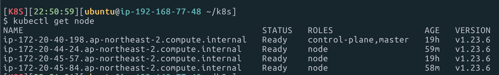
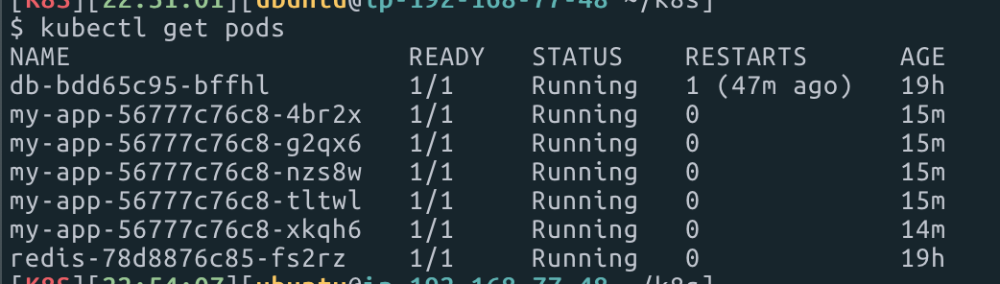

<p align="center">
    
</p>
<p align="center">
  
  
  <a href="https://edu.nextstep.camp/c/R89PYi5H" alt="nextstep atdd">
    
  </a>
  
</p>

<br>

# 인프라공방 샘플 서비스 - 지하철 노선도

<br>

## 🚀 Getting Started

### Install
#### npm 설치
```
cd frontend
npm install
```
> `frontend` 디렉토리에서 수행해야 합니다.

### Usage
#### webpack server 구동
```
npm run dev
```
#### application 구동
```
./gradlew clean build
```
<br>

## 미션

* 미션 진행 후에 아래 질문의 답을 작성하여 PR을 보내주세요.

### 1단계 - 쿠버네티스로 구성하기
1. 클러스터를 어떻게 구성했는지 알려주세요~ (마스터 노드 : n 대, 워커 노드 n대)
마스터노드 1대, 워커 노드 3대로 설정해봤습니다.



2. 스트레스 테스트 결과를 공유해주세요 (기존에 container 한대 운영시 한계점도 같이 공유해주세요)

`지하철역 등록` 스트레스 테스트 진행 시 정상적인 응답을 받은게 76% 에서 99% 로 늘었다는게 눈에 띄었고,  
컨테이너 1대를 운영했을 떄는 1대가 문제가 생겼을 때 모든 요청이 문제가 생겼지만  
여러대를 운영하면서 실패를 최소화할 수 있었습니다.


**데이터를 조회하는데 여러 데이터를 참조하는 페이지 - ( 경로검색 )**
```
running (15m00.7s), 000/330 VUs, 103397 complete and 0 interrupted iterations
default ↓ [======================================] 001/330 VUs  15m0s

     ✓ http status code 200
     ✓ stations is json path exist

     checks.........................: 100.00% ✓ 206794     ✗ 0
     data_received..................: 535 MB  593 kB/s
     data_sent......................: 12 MB   13 kB/s
     http_req_blocked...............: avg=115.23µs min=147ns   med=294ns   max=290.44ms p(90)=427ns    p(95)=495ns
     http_req_connecting............: avg=11.92µs  min=0s      med=0s      max=16.9ms   p(90)=0s       p(95)=0s
   ✗ http_req_duration..............: avg=50.46ms  min=1.79ms  med=5.65ms  max=3.05s    p(90)=99.12ms  p(95)=287.77ms
       { expected_response:true }...: avg=50.46ms  min=1.79ms  med=5.65ms  max=3.05s    p(90)=99.12ms  p(95)=287.77ms
     http_req_failed................: 0.00%   ✓ 0          ✗ 206794
     http_req_receiving.............: avg=140.81µs min=13.48µs med=36.91µs max=422.41ms p(90)=139.24µs p(95)=296.32µs
     http_req_sending...............: avg=47.22µs  min=17µs    med=34.83µs max=25.36ms  p(90)=60.29µs  p(95)=77µs
     http_req_tls_handshaking.......: avg=101.15µs min=0s      med=0s      max=289.42ms p(90)=0s       p(95)=0s
     http_req_waiting...............: avg=50.27ms  min=1.73ms  med=5.54ms  max=3.05s    p(90)=98.68ms  p(95)=287.51ms
     http_reqs......................: 206794  229.592185/s
     iteration_duration.............: avg=1.1s     min=1s      med=1.02s   max=4.06s    p(90)=1.29s    p(95)=1.54s
     iterations.....................: 103397  114.796092/s
     vus............................: 1       min=1        max=330
     vus_max........................: 330     min=330      max=330
   ✓ waitingTimeOnCachedData........: avg=7.66ms   min=1.73ms  med=4.45ms  max=975.64ms p(90)=10.69ms  p(95)=15.96ms
```

**접속 빈도가 높은 페이지 ( 메인 페이지 )**
```
running (15m00.3s), 000/330 VUs, 111554 complete and 0 interrupted iterations
default ✓ [======================================] 000/330 VUs  15m0s

     ✓ logged in successfully
     ✓ retrieved member

     checks.........................: 100.00% ✓ 223108   ✗ 0
     data_received..................: 73 MB   81 kB/s
     data_sent......................: 32 MB   36 kB/s
     http_req_blocked...............: avg=107.62µs min=154ns   med=327ns   max=323.57ms p(90)=444ns    p(95)=530ns
     http_req_connecting............: avg=12.65µs  min=0s      med=0s      max=27.28ms  p(90)=0s       p(95)=0s
   ✓ http_req_duration..............: avg=10.2ms   min=2.25ms  med=6.23ms  max=1.12s    p(90)=15.11ms  p(95)=21.68ms
       { expected_response:true }...: avg=10.2ms   min=2.25ms  med=6.23ms  max=1.12s    p(90)=15.11ms  p(95)=21.68ms
     http_req_failed................: 0.00%   ✓ 0        ✗ 223108
     http_req_receiving.............: avg=216.12µs min=11.2µs  med=34.79µs max=433.99ms p(90)=189.21µs p(95)=363.37µs
     http_req_sending...............: avg=59.22µs  min=18.29µs med=39.43µs max=41.77ms  p(90)=70.31µs  p(95)=95.61µs
     http_req_tls_handshaking.......: avg=92.36µs  min=0s      med=0s      max=322.5ms  p(90)=0s       p(95)=0s
     http_req_waiting...............: avg=9.93ms   min=0s      med=6.1ms   max=1.12s    p(90)=14.77ms  p(95)=21.2ms
     http_reqs......................: 223108  247.8236/s
     iteration_duration.............: avg=1.02s    min=1s      med=1.01s   max=2.24s    p(90)=1.03s    p(95)=1.04s
     iterations.....................: 111554  123.9118/s
     vus............................: 1       min=1      max=330
     vus_max........................: 330     min=330    max=330
```

**데이터를 갱신 하는 페이지 ( 지하철역 등록 )**
```

running (15m00.5s), 000/750 VUs, 269809 complete and 0 interrupted iterations
default ↓ [======================================] 001/750 VUs  15m0s

   ✓ Content Created................: 99.99% ✓ 269806     ✗ 3
     data_received..................: 107 MB 118 kB/s
     data_sent......................: 30 MB  33 kB/s
     http_req_blocked...............: avg=94.92µs  min=142ns   med=312ns   max=48.85ms  p(90)=425ns    p(95)=496ns
     http_req_connecting............: avg=12.42µs  min=0s      med=0s      max=22.9ms   p(90)=0s       p(95)=0s
   ✓ http_req_duration..............: avg=9.49ms   min=3.28ms  med=8.32ms  max=314.39ms p(90)=13.43ms  p(95)=16.18ms
       { expected_response:true }...: avg=9.49ms   min=3.28ms  med=8.32ms  max=314.39ms p(90)=13.43ms  p(95)=16.18ms
   ✓ http_req_failed................: 0.00%  ✓ 3          ✗ 269806
     http_req_receiving.............: avg=114.31µs min=11.99µs med=36.36µs max=58.12ms  p(90)=215.79µs p(95)=367.81µs
     http_req_sending...............: avg=58.04µs  min=20.8µs  med=41.27µs max=43.7ms   p(90)=74.8µs   p(95)=123.07µs
     http_req_tls_handshaking.......: avg=80.27µs  min=0s      med=0s      max=38.68ms  p(90)=0s       p(95)=0s
     http_req_waiting...............: avg=9.32ms   min=3.17ms  med=8.16ms  max=313.8ms  p(90)=13.21ms  p(95)=15.93ms
     http_reqs......................: 269809 299.629165/s
     iteration_duration.............: avg=1.01s    min=1s      med=1s      max=1.31s    p(90)=1.01s    p(95)=1.01s
     iterations.....................: 269809 299.629165/s
     vus............................: 1      min=1        max=750
     vus_max........................: 750    min=750      max=750
```


3. 현재 워커노드에서 몇대의 컨테이너를 운영중인지 공유해주세요

redis 1대, db1대, was5대로 운영중입니다.




---

### [추가] 클러스터 운영하기
1. kibana 링크를 알려주세요

2. grafana 링크를 알려주세요

3. 지하철 노선도는 어느정도로 requests를 설정하는게 적절한가요?

4. t3.large로 구성할 경우 Node의 LimitRange, ResourceQuota는 어느정도로 설정하는게 적절한가요?

5. 부하테스트를 고려해볼 때 Pod은 몇대정도로 구성해두는게 좋다고 생각하나요?

6. Spinaker 링크를 알려주세요.
