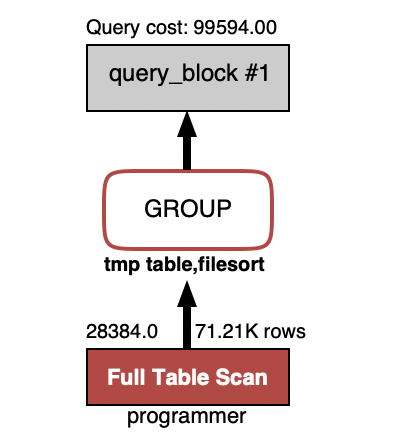
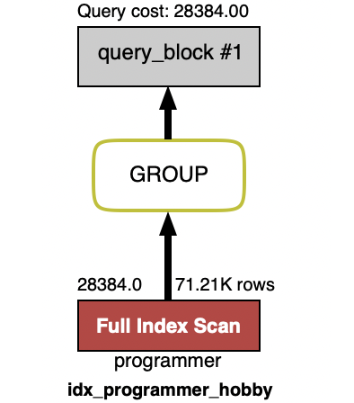
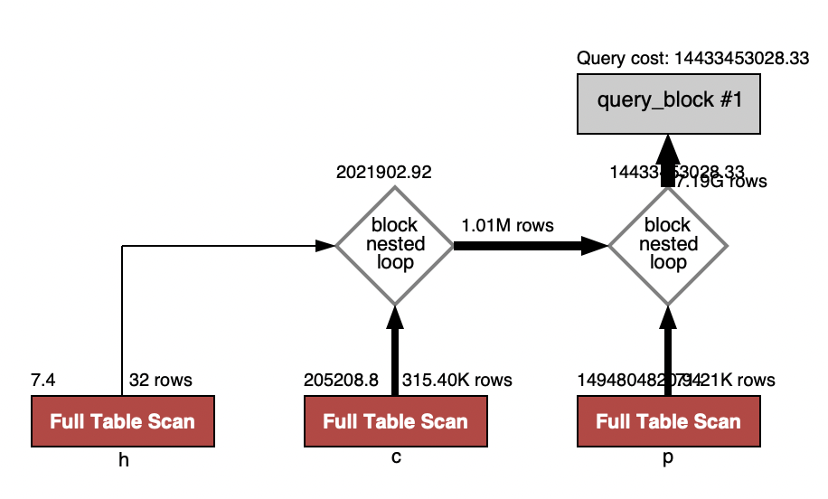
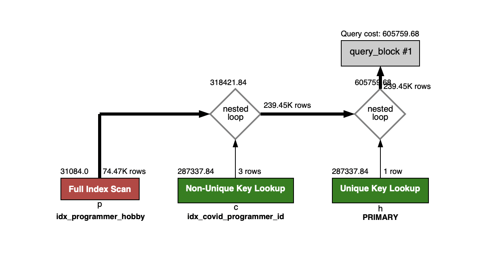
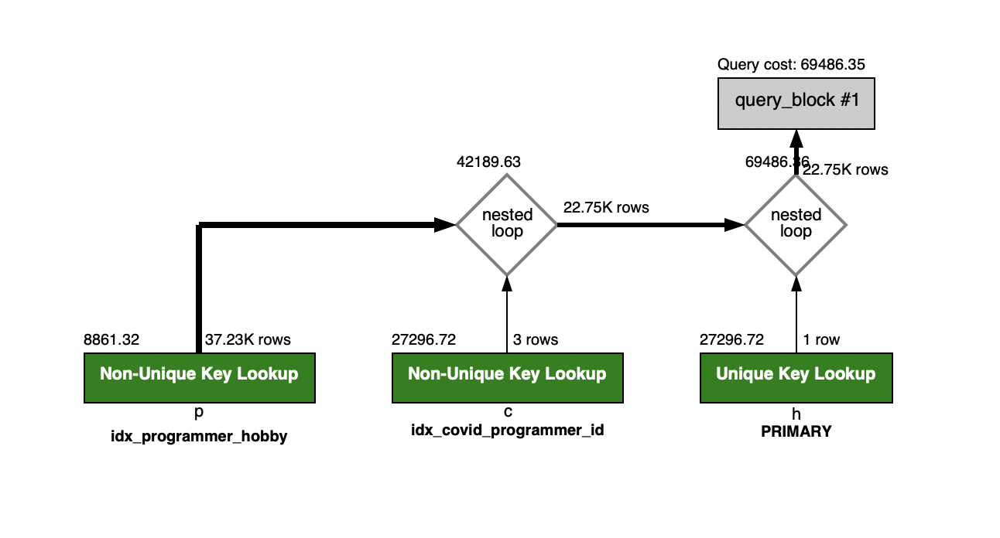
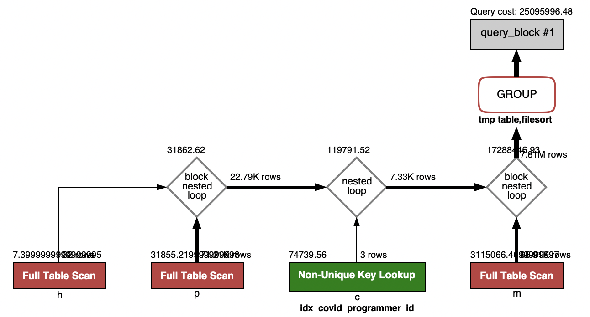
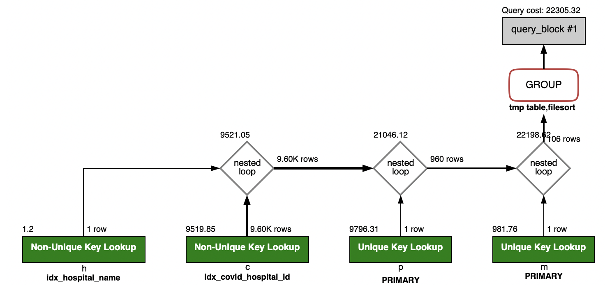
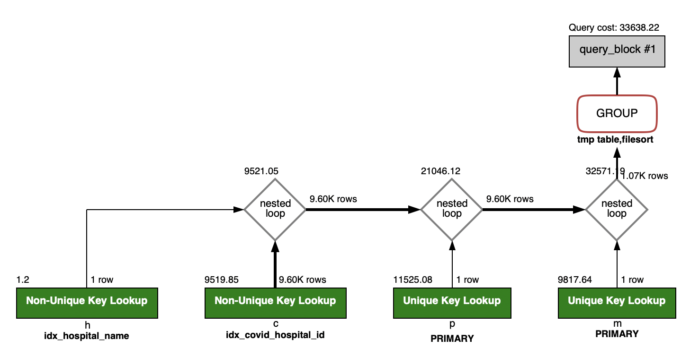

<p align="center">
    
</p>
<p align="center">
  
  
  <a href="https://edu.nextstep.camp/c/R89PYi5H" alt="nextstep atdd">
    
  </a>
  
</p>

<br>

# 인프라공방 샘플 서비스 - 지하철 노선도

<br>

## 🚀 Getting Started

### Install
#### npm 설치
```
cd frontend
npm install
```
> `frontend` 디렉토리에서 수행해야 합니다.

### Usage
#### webpack server 구동
```
npm run dev
```
#### application 구동
```
./gradlew clean build
```
<br>

## 미션

* 미션 진행 후에 아래 질문의 답을 작성하여 PR을 보내주세요.

### 1단계 - 쿼리 최적화

1. 인덱스 설정을 추가하지 않고 아래 요구사항에 대해 200ms 이하(M1의 경우 2s)로 반환하도록 쿼리를 작성하세요.

- 활동중인(Active) 부서의 현재 부서관리자 중 연봉 상위 5위안에 드는 사람들이 최근에 각 지역별로 언제 퇴실했는지 조회해보세요. (사원번호, 이름, 연봉, 직급명, 지역, 입출입구분, 입출입시간)
~~~ sql
select a.id                 as 사원번호,
       a.last_name          as 이름,
       a.annual_income      as 연봉,
       a.position_name      as 직급명,
       record.time          as 입출입시간,
       record.region        as 지역,
       record.record_symbol as 입출입구분
from (select employee.id,
             employee.last_name,
             position.position_name,
             salary.annual_income
      from department
               inner join manager on department.id = manager.department_id
               inner join position on position.id = manager.employee_id
               inner join employee on employee.id = manager.employee_id
               inner join salary on salary.id = manager.employee_id
      where department.note = 'active'
        and manager.end_date = '9999-01-01'
        and position.end_date = '9999-01-01'
        and salary.end_date = '9999-01-01'
      order by salary.annual_income desc
      limit 5) as a
         inner join record on employee_id = a.id
where record.record_symbol = 'O';
~~~
---

### 2단계 - 인덱스 설계

1. 인덱스 적용해보기 실습을 진행해본 과정을 공유해주세요
- [X] Coding as a Hobby 와 같은 결과를 반환하세요.
    ~~~sql
    select hobby, concat(round(count(1) / (select count(1) from programmer) * 100, 1), '%')
    from programmer
    group by hobby desc;
    ~~~
    - 인덱스 추가전: 4.236s
      - 
    - 인덱스 추가 
      ~~~sql
      create index idx_programmer_hobby on programmer (hobby);
      ~~~
    - 인덱스 추가후: 0.467s
      - 

- [x] 프로그래머별로 해당하는 병원 이름을 반환하세요. (covid.id, hospital.name)
    ~~~sql
    select c.id   as covid_id,
       h.name as hospital_name
    from programmer p
            inner join covid c on c.programmer_id = p.id
            inner join hospital h on c.hospital_id = h.id;
    ~~~
    - 인덱스 추가전: 4.033s
      - 
    - 인덱스 추가
      ~~~sql
      alter table programmer add primary key(id);
      alter table hospital add primary key(id);
      create index idx_covid_programmer_id on covid (programmer_id);
      ~~~
    - 인덱스 추가후: 0.033s
      - 

- [x] 프로그래밍이 취미인 학생 혹은 주니어(0-2년)들이 다닌 병원 이름을 반환하고 user.id 기준으로 정렬하세요. (covid.id, hospital.name, user.Hobby, user.DevType, user.YearsCoding)
    ~~~sql
    select c.id           as covid_id,
            h.name         as hospital_name,
            a.hobby        as hobby,
            a.dev_type     as dev_type,
            a.years_coding as years_coding
    from (select p.id,
                 p.hobby,
                 p.dev_type,
                 p.years_coding
    from programmer p
    where p.hobby = 'Yes'
      and (p.dev_type = 'Student'
        or p.years_coding = '0-2 years')
    order by p.id) as a
        inner join covid c on c.programmer_id = a.id
        inner join hospital h on c.hospital_id = h.id;
    ~~~
    - 별도 인덱스 추가 안함: 0.170s
      - 

- [x] 서울대병원에 다닌 20대 India 환자들을 병원에 머문 기간별로 집계하세요. (covid.Stay)
    ~~~sql
    select c.stay,
       count(1) as cnt
    from programmer p
            inner join covid c on c.programmer_id = p.id
            inner join member m on m.id = c.member_id
            inner join hospital h on h.id = c.hospital_id
    where h.name = '서울대병원'
      and m.age between 20 and 29
      and p.country = 'India'
    group by c.stay;
    ~~~
    - 인덱스 추가전: 13.740s
        - 
    - 인덱스 추가
      ~~~sql
      alter table member add primary key(id);
      create index idx_hospital_name on hospital (name);
      create index idx_covid_hospital_id on covid (hospital_id);
      ~~~
    - 인덱스 추가후: 0.148s
        - 
  
- [x] 서울대병원에 다닌 30대 환자들을 운동 횟수별로 집계하세요. (user.Exercise)
    ~~~sql
    select p.exercise        as user_exercise,
            count(p.exercise) as cnt
    from programmer p
            inner join covid c on c.programmer_id = p.id
            inner join hospital h on h.id = c.hospital_id
            inner join member m on m.id = c.member_id
    where h.name = '서울대병원'
      and m.age between 30 and 39
    group by p.exercise;
    ~~~
    - 별도 인덱스 추가 안함: 0.167s
      - 
    
---


### 3단계 - 쿠버네티스로 구성하기
1. 클러스터를 어떻게 구성했는지 알려주세요~ (마스터 노드 : n 대, 워커 노드 n대)

2. 스트레스 테스트 결과를 공유해주세요 (기존에 container 한대 운영시 한계점도 같이 공유해주세요)

3. 현재 워커노드에서 몇대의 컨테이너를 운영중인지 공유해주세요

---

### [추가] DB 미션

1. 페이징 쿼리를 적용한 API endpoint를 알려주세요

---


### [추가] 클러스터 운영하기
1. kibana 링크를 알려주세요

2. grafana 링크를 알려주세요

3. 지하철 노선도는 어느정도로 requests를 설정하는게 적절한가요?

4. t3.large로 구성할 경우 Node의 LimitRange, ResourceQuota는 어느정도로 설정하는게 적절한가요?

5. 부하테스트를 고려해볼 때 Pod은 몇대정도로 구성해두는게 좋다고 생각하나요?

6. Spinaker 링크를 알려주세요.
